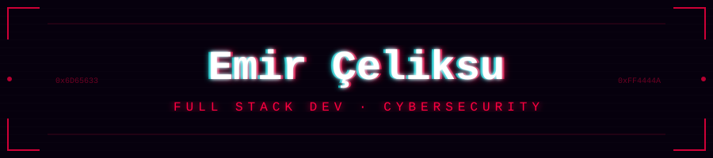
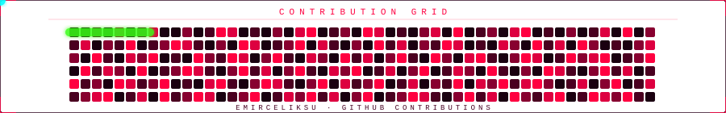

<!-- MATRIX RAIN HEADER -->
<div align="center">



<!-- GLITCH BANNER -->


<br/>

<!-- CYBER TYPING SVG -->
<a href="https://git.io/typing-svg">
  
</a>

<br/><br/>

<!-- BADGES -->

&nbsp;
<a href="https://github.com/emirceliksu?tab=followers">
  
</a>
&nbsp;
<a href="https://github.com/emirceliksu?tab=following">
  
</a>
&nbsp;


</div>

<!-- TERMINAL BOOT SCREEN -->


<!-- CYBER LOGO + TITLE -->
<div align="center">
<br/>


<br/><br/>

```
+------------------------------------------------------------------+
|  > OPERATOR  : Muhammed Emir Celiksu                            |
|  > CLASS     : Full Stack Dev  //  Cybersecurity Researcher     |
|  > CLEARANCE : RED TEAM  [##########]  100%                     |
|  > LOCATION  : Turkey [ UTC+3 ]  .  ONLINE                     |
+------------------------------------------------------------------+
```

</div>

<!-- TECH STACK -->
<div align="center">

### `[ WEAPONS LOADOUT ]`

**Languages**


**Frontend**


**Backend & Databases**


**DevOps & Tools**


**`[ OFFENSIVE SECURITY TOOLS ]`**


</div>

<!-- CONNECT -->
<div align="center">

### `[ OPEN CHANNELS ]`

<a href="https://instagram.com/emir_celiksu" target="_blank">
  
</a>
&nbsp;
<a href="https://github.com/emirceliksu" target="_blank">
  
</a>

</div>

<!-- SYSTEM METRICS -->
<div align="center">

### `[ SYSTEM METRICS ]`



</div>

<!-- CONTRIBUTION SNAKE -->
<div align="center">

### `[ NETWORK ACTIVITY ]`



</div>

<!-- FOOTER -->


<div align="center">

`[ CONNECTION TERMINATED ]`

</div>